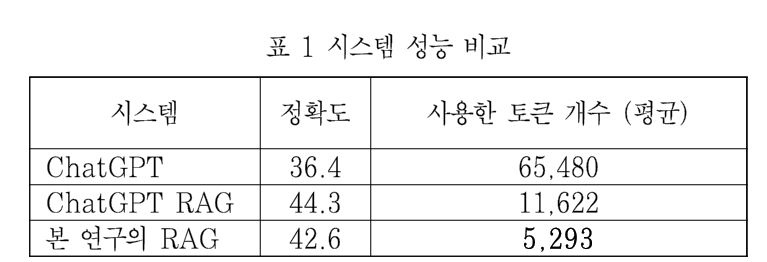
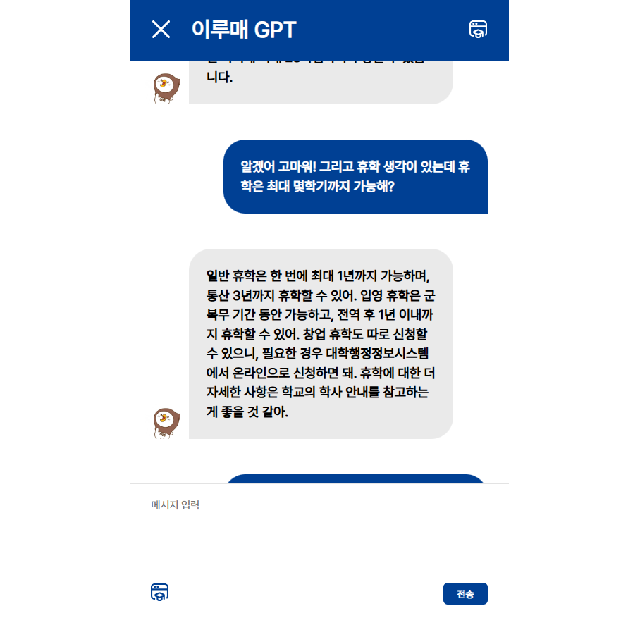
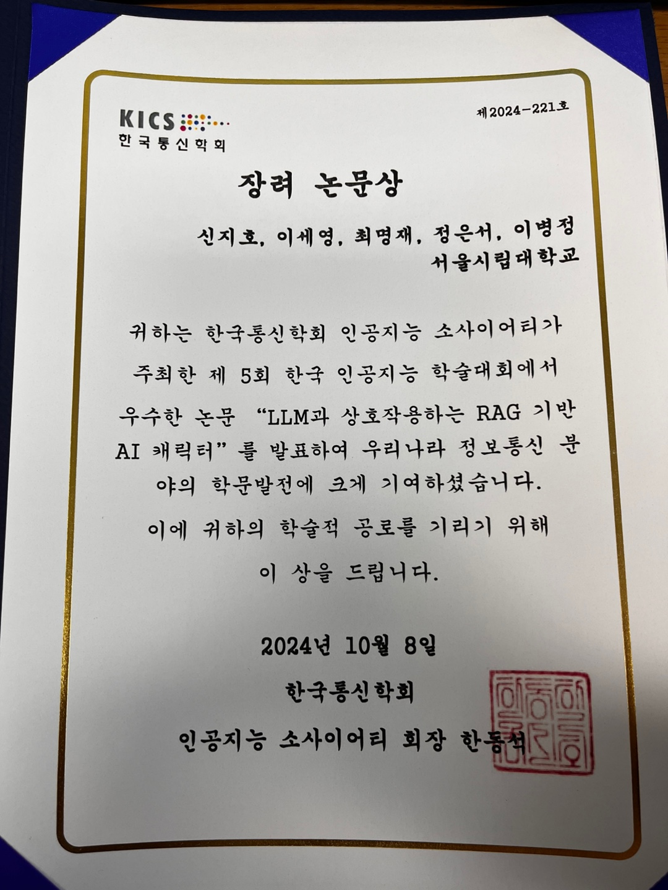
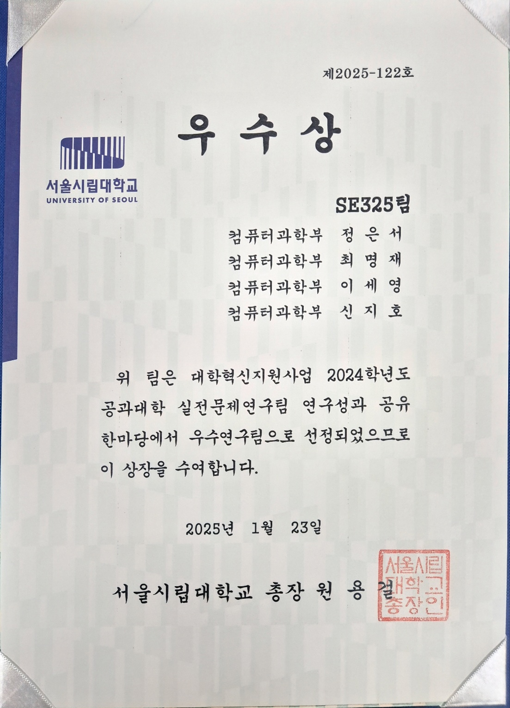

## 🔎 프로젝트 소개  

위 프로젝트는 다음과 같은 배경에서 진행된 지식 그래프 기반 에피소드 기억을 사용한 RAG 시스템 입니다.
- RAG 기술은 일회성 응답을 위한 LLM 모델에 정보를 주입하는 방식으로 사용된다.  
- 비서 챗봇과 같은 시스템에선 정보 주입 뿐만 아니라 지속적인 대화를 기억하고 활용하는 시스템이 필요하다.  
- 본 프로젝트에서는 개인화 가능한 AI 챗봇을 위한 RAG 시스템을 소개하고 한국어 대화 데이터셋을 이용해 정확한 정보를 제공하는지 테스트 하는 것을 목표로 한다.

<br>

### 1. 프로젝트 기간
 **2024.08.20 ~ 2025.01.23**

<br>

### 2. 포함 내용
1. 프로젝트 소개
2. 사용 기술 스택
3. 프로젝트 Flow
4. 디렉토리 구조 및 패키지 역할
5. 기술적 이슈 및 해결 과정
6. 관련 서비스 개발 및 성과
7. 프로젝트 팀원 및 역할
   
<br>

## 🔧 사용 기술 스택

### Backend and DB
- FastAPI
- MySQL
- Neo4j 

### LLM
- ChatGPT 4o API

### Tools
- GitHub

<br>

## 🚀 프로젝트 Flow


1. 사용자의 질의가 시스템에 입력되면 이전 대화 내용과 비교해서 문맥의 변화를 감지한다.   

2. 만약 문맥이 변했다면 지금 까지의 대화 내용을 기반으로 정보를 추론한다. 추론한 형태는 (주어, 동사, 목적어)의 트리플 형태로 나타낸다.

3. 주어와 목적어는 노드로 동사는 엣지의 형태로 그래프DB에 저장한다.   동시에 지금 까지의 대화 내용을 에피소드에 저장한다. 이 때 Edge의 property로 episodeId를 설정해 에피소드와 지식 그래프를 연결시킨다.

4. 이후 각 노드의 자연어 임베딩값을 이용하여 비슷한 의미를 가진 노드들끼리 커뮤니티를 생성한다.

5. 사용자 질의와 가장 비슷한 상위 n%의 커뮤니티를 선정하고 그 커뮤니티의 노드와 엣지를 연결한 문장과 episodeId를 이용하여 가져온 에피소드들의 문장을 이용하여 답변을 생성한다.

- 만약 1에서 문맥이 변하지 않았다면, 5번만 실행한다.

<br>

## 📂 디렉토리 구조 및 패키지 역할
```
ROOT
 ┣ AuthManager
 ┃ ┣ controller
 ┃ ┣ model
 ┃ ┣ service
 ┃ ┣ util
 ┃ 
 ┣ chatingManager
 ┃
 ┣ client
 ┃
 ┣ globals
 ┃ ┣ util
 ┃ ┗ .env
 ┃ 
 ┣ k_memorySystem
 ┃ ┣ episodeManager
 ┃ ┣ KnowledgeManager
 ┃ ┗ LLMController
 ┃
 ┗ ChatbotController.py
 ```
 - AuthManager : 추후 서비스화를 위한 인증 및 인가처리를 위한 패키지
   - controller : User로 부터 Request를 받는 패키지
   - model : Request Type 패키지지
   - service : Reqeust를 적절하게 처리하는 패키지
   - util : 인증 인가 처리에 관한 유틸 패키지    

 - chatingManager : 채팅과 관련된 역할을 하는 패키지
 - client : 테스트 데이터 및 사전 데이터를 학습하기 위한 패키지
 - globals : DB 연결과 같은 전역적으로 해야하는 작업 패키지
   - util : 전역적으로 처리해야하는 유틸 패키지
   - .env : 환경변수로 설정한 파일 (보안이 필요한 데이터)
 - k_memorySystem : 프로젝트 핵심 기억 시스템 패키지
   - episodeManager : 에피소드와 관련된 처리를 하는 패키지
   - KnowledgeManager : 지식 그래프와 관련된 처리를 하는 패키지
   - LLMController : 생성형 AI와 API를 이용하여 소통을 하는 패키지
 - ChatbotController.py : 메인 서버 Controller, 프로젝트 Flow의 역할을 수행한다. 

<br>

## ✅ 기술적 이슈 및 해결 과정
1. 커뮤니티 탐지를 위해 어떠한 알고리즘을 사용해야 할까?
    - 초기에 Neo4j GDS 라이브러리의 Louvain 알고리즘을 사용했음.
    - 하지만 커뮤니티를 나눈 결과가 원하는 대로 나오지 않았음.
    - 팀원들끼리 회의한 후 유사한 그룹을 더 잘 표현할 수 있는 Kmeans 알고리즘을 사용하기로 결정함.
      
2. 여러 패키지에서 DB 연결을 동시에 진행하고 있음.
    - ChatingManager, AuthManager, episodeManager 패키지에서 DB연결을 진행함.
    - 코드의 중복성을 제거하기 위해 전역적으로 설정할 수 있는 globals 패키지에 DB를 연결할 수 있는 util 파일을 만듬.
    - 외부 패키지에서 DBUtil에 있는 connection 변수를 import만 해도 DB를 바로 사용할 수 있다. 

<br>

## 🥇 관련 서비스 개발 및 성과

### 1. 프로젝트 실험 결과

본 프로젝트에서는 다음과 같은 3가지 모델을 두어 비교를 하였다.   

- ChatGPT 와 비교해서는 정확도를 높이고 사용한 토큰 개수는 대폭 줄였다.
- ChatGPT RAG와 비교해서는 정확도를 거의 유지하고 토큰 개수는 2배 정도 줄였다. 

본 프로젝트의 결과 정확도를 비슷하게 유지하면서 토큰의 개수를 많이 줄여 경제적인 효율성까지 얻는 결과를 도출하였다.    

### 2. 교내 학습 도우미 이루매GPT

본 프로젝트의 지식 그래프, 에피소드를 이용한 RAG 기술을 적용하여 직접 교내 학습 도우미 웹 챗봇 서비스로 구현   

- 새내기 학습 가이드의 내용을 초기에 학습하여 교내 구성원들이 학교 생활에 대해 질문했을 때 도움을 줌.

- 대화를 할 때마다 대화 내용이 저장됨.

- 상단과 하단에 있는 학습 버튼을 통해 개인화가 가능하도록 구현함.
 
<br>

### 3. 논문 발표
본 프로젝트의 내용을 기반으로 제작한 논문 입니다.   
[논문 보러 가기](readmeAsset/AI캐릭터논문2.pdf)

<br>

### 4. 수상
#### 제5회 인공지능학술대회 장려 논문상


#### 서울시립대 공과대학 실전문제연구대회 우수상


<br>

## 👬 프로젝트 팀원 및 역할
1. 🐶이세영 [@LSe-Yeong](https://github.com/LSe-Yeong)
2. 🐰최명재 [@DdingJae418](https://github.com/DdingJae418)
3. 🐱신지호 [@simpack0513](https://github.com/simpack0513)
